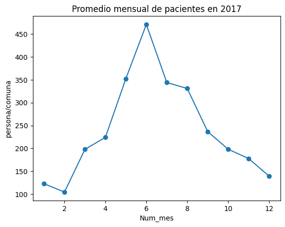
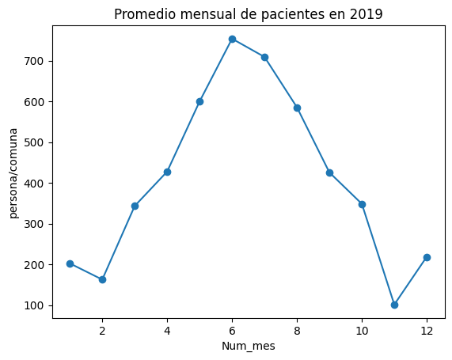
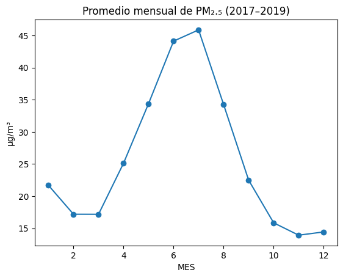
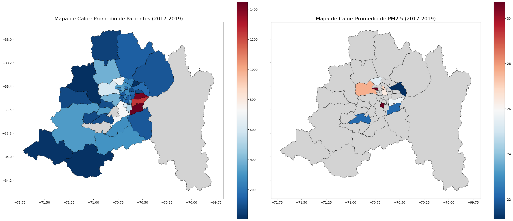
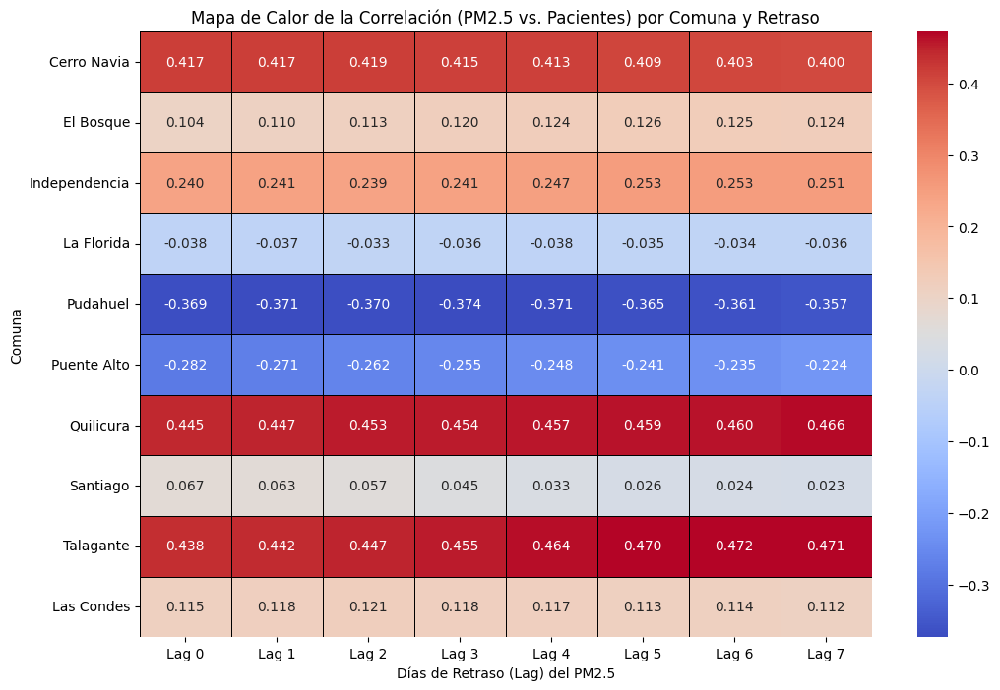

# **Impacto de la contaminación por material particulado en la salud respiratoria de los habitantes de Santiago de Chile (2017-2019)**

Este proyecto estudia cómo varían los casos de enfermedades respiratorias en relación con los niveles de contaminación atmosférica
por material particulado fino (PM₂₅) en la Región Metropolitana de Santiago entre 2017 y 2019.

La motivación surge del persistente problema de calidad del aire en Santiago, donde los niveles de PM₂₅ superan ampliamente los estándares
recomendados por la OMS y se intensifican durante los meses de invierno, coincidiendo con aumentos en enfermedades respiratorias reportados por
la literatura científica y medios nacionales.

## **Objetivo General**

Evaluar la relación temporal entre los niveles de contaminación atmosférica (PM₂₅) y los registros de enfermedades respiratorias en
Santiago, con el fin de identificar patrones y posibles asociaciones entre ambas variables.

## **Objetivos Específicos**

-   Analizar la evolución mensual de pacientes con enfermedades respiratorias en la RM.
-   Examinar los niveles de PM₂₅ registrados entre 2017 y 2019.
-   Identificar coincidencias temporales entre incrementos de contaminación y aumento de consultas médicas.
-   Explorar diferencias estacionales (invierno vs. verano).

## **Alcance y Ajustes Metodológicos**

El proyecto originalmente incluía variables climáticas (NASA POWER) y socioeconómicas (CASEN). Sin embargo, se descartaron por:

-   **Falta de necesidad real** de la API NASA dado el enfoque final.
-   **Incompatibilidad y complejidad** del análisis socioeconómico para la escala del proyecto.
-   **Ausencia de suficientes variables climáticas** en los datasets definitivos.

El análisis se centró exclusivamente en:

- **Datos de salud del DEIS (REM)**: número de pacientes por causa respiratoria por comuna y mes.
- **Datos de contaminación del SINCA**: niveles de PM₂₅ por estación de monitoreo.

## **Fuentes de Datos Utilizadas**

### **1. DEIS -- Sistema de Reportes REM (MINSAL)**

-   Variables: motivo de consulta, número de pacientes, comuna.
-   Formato: XLS (estructura HTML).
-   Cobertura: mensual, 2017-2019.

### **2. SINCA -- Sistema de Información Nacional de Calidad del Aire (MMA)**

-   Variables: fecha, PM₂₅ validado y preliminar.
-   Formato: CSV.
-   Cobertura: estaciones de la Región Metropolitana, 2017-2019.

## **Metodología**

1.  Recolección de datos desde plataformas oficiales.
2.  Limpieza y estandarización de fechas, comunas y registros numéricos.
3.  Análisis Exploratorio de Datos (EDA) mediante:
    - Numérico 
        - Estadísticas descriptivas 
    - Visual: 
        - Gráficos de líneas (Gráficos de tendencia temporal y Promedios por mes y comuna)
        - Gráficos boxplot
        - Gráficos heatmap (para estudiar relaciones y distribuciones entre las variables)
        - Mapas y visualizaciones geográficas.
4.  Comparación temporal entre:
    -   Niveles de PM₂₅.
    -   Número de pacientes por causas respiratorias.

## **Resultados Principales**

-   Se observa un **aumento simultáneo** de contaminación y casos respiratorios en los meses fríos (mayo--agosto):

    
  
  

-   El patrón temporal confirma **diferencias estacionales marcadas**, con picos en invierno.
-   No existe correlación geográfica clara entre comunas con mayor polución y aquellas con mayor número de pacientes:

  

-   Las diferencias pueden deberse a:
    -   Coberturas desiguales de sensores,
    -   Variaciones poblacionales,
    -   Causas no ambientales de enfermedades,
    -   Desbalance en el tamaño de los conjuntos de datos.

## **Conclusiones**

### 1. Vínculo Cuantificado y Evaluación de Modelos
El análisis de series de tiempo por comuna demostró que el material particulado fino PM₂₅ es un predictor significativo, pero heterogéneo, de la demanda de atenciones de urgencia respiratoria (REM) en Santiago.

#### A. Desempeño y Predictibilidad
Luego de realizar unos modelos para evaluar el alineamiento de los datos, se logra observar que los modelos más confiables son aquellos que en ciertas comunas presentan un R² alto y MSE bajo; esta condición se cumple levemente en las comunas de Quilicura y Talagante, donde cerca del 30% de la variabilidad de las atenciones de urgencias se explica por el PM₂₅ rezagado, con error cuadrático promedio de ~ 110 a 116 atenciones al cuadrado. EN contraste, el alto MSE de Puente alto  (≈ 255) confirma que la regresión lineal es un modelo inadecuado para esa comuna, probablemente debido a factores no lineales o la influencia de otras variables.

#### B. El Mecanismo Temporal (Lag)
El resago o retraso temporal óptimo varía entre 0 y 7 días, lo que sugiere que el PM₂₅ activa diferentes mecanismos biológicos y conductuales:
- **Efecto Sub-Agudo/Acumulativo (6-7 días):** Dominante en Quilicura y Talagante. La correlación más fuerte ocurre a la semana, implicando que el daño se relaciona con la exposición sostenida, activando o agravando condiciones crónicas (asma, EPOC).
- **Efecto Agudo (2 días):** Visto en Cerro Navia y Las Condes, reflejando respuestas inflamatorias inmediatas.

### 2. Correlación Inversa
Las comunas con el PM₂₅ más alto (ej. Pudahuel y Puente Alto) presentan coeficientes Beta negativos. Esto significa que cuando la contaminación sube, la demanda de urgencias reportada tiende a bajar.

  

## Recomendaciones de Políticas Públicas Estratégicas

El principio clave es la diferenciación geográfica y temporal de las estrategias:
1.	**Focalización de la Inversión Sanitaria (Regla del R²):** Los recursos para predicción y alerta deben centrarse en Quilicura y Talagante, ya que el modelo de PM₂₅ es el más fiable y eficiente para anticipar la demanda de salud (R² ≈ 30%).

2.	**Sistema de Alerta con Doble Horizonte Temporal:**
- **Alerta de Urgencia:** Activar la movilización de personal y camas en comunas como Cerro Navia con 48 horas de anticipación ante peaks pronosticados.
- **Alerta Preventiva y Crónica:** Activar campañas de seguimiento telefónico y entrega anticipada de medicamentos a pacientes crónicos en Quilicura y Talagante ante la proyección de una semana de alta polución.
3.	**Cuantificación del Beneficio Económico (Uso del Beta):** El coeficiente Beta permite monetizar el impacto de la reducción de la contaminación. Por ejemplo, en Quilicura, la reducción sostenida de 1mμ g/m³ de PM₂₅ ahorraría el costo de 0.346 atenciones diarias de urgencia, justificando la inversión en políticas de control de emisiones.

## **Estructura del Repositorio**

    IntroCSDatosProyecto/
    ├── 1era Entrega/
    │   └── Informe de Propuesta Inicial
    ├── 2da Entrega/
    │   ├── data/
    │   │   ├── Comunas/
    │   │   ├── Estaciones17-19/
    │   │   └── REM/
    │   ├── información y contexto.ipynb
    │   └── relacion_PM_con_mapa_comunas_y_pacientes (unificación).ipynb
    ├── 3era Entrega/
    │   ├── data/
    │   │   ├── Comunas/
    │   │   ├── Estaciones17-19/
    │   │   └── REM/
    │   ├── 3era Entrega.ipynb
    │   └── Notebook_E3.ipynb
    └── README.md
